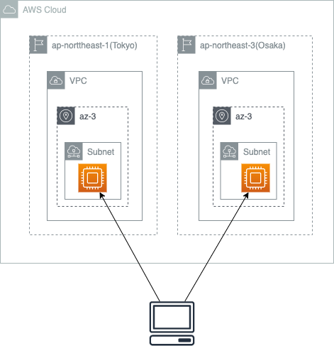

# aws-cdk-sample

## Cfn File

[cfn.yml](./cfn-template/cfn.yml)

note: 
`cdk synth >> ..\cfn-template\cfn.yml`

## Overview

Region: ap-northeast-1(Tokyo), ap-northeast-3(Osaka)  
Resource: VPC, Subnets(Single-AZ), Compute, EIP  
Security Group: allow IPv4 ICMP all, allow IPv4 SSH all , allow IPv4 RDP all 

<!-- following: -->

<!--  -->

## Enviorment

### Node.js & npm

```
$ node -v;npm -v                
v10.19.0
7.5.4
$ 
```

### [AWS CLI](https://aws.amazon.com/jp/cli/)

#### Windows

##### Preparation

[chcolatey](https://chocolatey.org/)
```
Set-ExecutionPolicy Bypass -Scope Process -Force; [System.Net.ServicePointManager]::SecurityProtocol = [System.Net.ServicePointManager]::SecurityProtocol -bor 3072; iex ((New-Object System.Net.WebClient).DownloadString('https://chocolatey.org/install.ps1'))
```

##### Install

[aws cli](https://chocolatey.org/packages/awscli)
```
choco install awscli
```

#### Mac

##### Preparation

[homebrew](https://brew.sh/index_ja)
```
/bin/bash -c "$(curl -fsSL https://raw.githubusercontent.com/Homebrew/install/HEAD/install.sh)"
```

##### Install

[aws cli](https://formulae.brew.sh/formula/awscli)
```
brew install awscli
```

### AWS CDK

##### Install 

```
npm install -g aws-cdk
```

##### Check

```
$ cdk --version
1.94.1 (build 60d8f91)
$ 
```

## Create Project

### Working Directory

```
$ git clone https://github.com/midnight480/aws-cdk-sample.git
$ mkdir src && cd src
```

### Init(Optional)

```
$ cdk init app --language typescript
```
### Modify Files

**default**

```
$ cat lib/src-stack.ts
import * as cdk from '@aws-cdk/core';

export class SrcStack extends cdk.Stack {
  constructor(scope: cdk.Construct, id: string, props?: cdk.StackProps) {
    super(scope, id, props);

    // The code that defines your stack goes here
  }
}
$
```
### Add Module

```
$ cdk --version
1.101.0 (build 149f0fc)
```

```
npm install @aws-cdk/aws-ec2@x.xxx.xxx
```

or 

```
ls -la ./package.json
npm install
```

### Sample Deploy

```
cdk deploy TokyoVpc -c key_pair=sample
```

```
cdk deploy OsakaVpc -c key_pair=sample
```

### Profile

*Use TokyoVpc

```
$ aws configure
AWS Access Key ID [None]: 
AWS Secret Access Key [None]: 
Default region name [ap-northeast-1]: 
Default output format [None]: 
```

*Use OsakaVpc

```
$ aws configure
AWS Access Key ID [None]: 
AWS Secret Access Key [None]: 
Default region name [ap-northeast-3]: 
Default output format [None]: 
```
